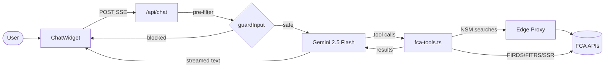

# FCA Chatbot — Architecture Diagram

```mermaid
flowchart LR
    User([User]) --> ChatWidget
    ChatWidget -->|POST SSE| API["/api/chat"]
    API -->|pre-filter| Guard{guardInput}
    Guard -->|blocked| ChatWidget
    Guard -->|safe| Gemini[Gemini 2.5 Flash]
    Gemini -->|tool calls| FCATools[fca-tools.ts]
    FCATools -->|NSM searches| FCAProxy[Edge Proxy]
    FCAProxy --> FCA[(FCA APIs)]
    FCATools -->|FIRDS/FITRS/SSR| FCA
    FCATools -->|results| Gemini
    Gemini -->|streamed text| ChatWidget
```
