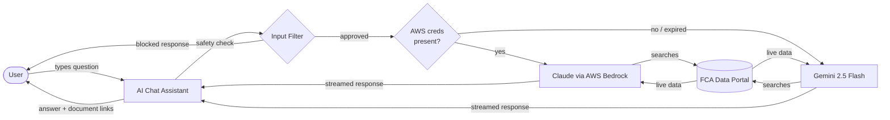
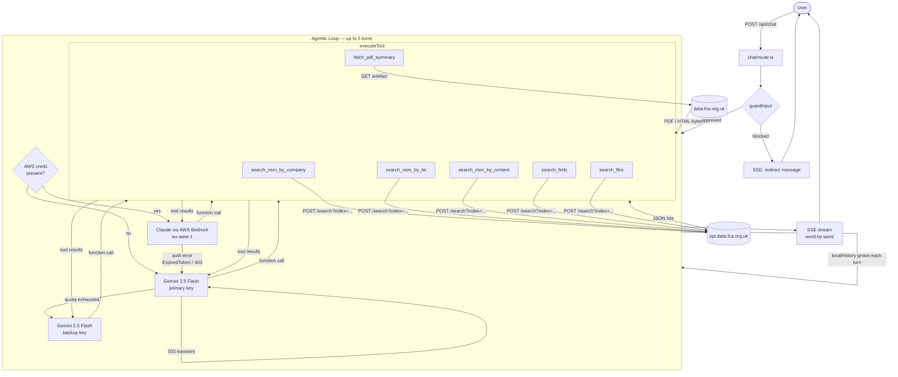

# FCA Chatbot — Architecture Diagram

## Stakeholder View

```mermaid
flowchart LR
    User([User]) -->|types question| Chat[AI Chat Assistant]
    Chat -->|safety check| Guard{Input Filter}
    Guard -->|blocked response| User
    Guard -->|approved| Provider{AWS creds\npresent?}
    Provider -->|yes| Bedrock[Claude via AWS Bedrock]
    Provider -->|no / expired| Gemini[Gemini 2.5 Flash]
    Bedrock -->|searches| FCA[(FCA Data Portal)]
    Gemini -->|searches| FCA
    FCA -->|live data| Bedrock
    FCA -->|live data| Gemini
    Bedrock -->|streamed response| Chat
    Gemini -->|streamed response| Chat
    Chat -->|answer + document links| User
```

## Technical View

```mermaid
flowchart TD
    User([User]) -->|POST /api/chat| Route[chat/route.ts]

    Route --> Guard{guardInput}
    Guard -->|blocked| Stream1[SSE: redirect message]
    Stream1 --> User

    Guard -->|approved| Loop

    subgraph Loop [Agentic Loop — up to 5 turns]
        direction TB
        ProviderSelect{AWS creds\npresent?}
        ProviderSelect -->|yes| Bedrock[Claude via AWS Bedrock\neu-west-1]
        ProviderSelect -->|no| Gemini[Gemini 2.5 Flash\nprimary key]
        Bedrock -->|auth error\nExpiredToken / 403| Gemini
        Gemini -->|quota exhausted| GeminiB[Gemini 2.5 Flash\nbackup key]
        Gemini -->|503 transient| Gemini
        Bedrock -->|function call| Tools
        Gemini -->|function call| Tools
        GeminiB -->|function call| Tools

        subgraph Tools [executeTool]
            direction LR
            NSM1[search_nsm_by_company]
            NSM2[search_nsm_by_lei]
            NSM3[search_nsm_by_content]
            FIRDS[search_firds]
            FITRS[search_fitrs]
            PDF[fetch_pdf_summary]
        end

        Tools -->|tool results| Bedrock
        Tools -->|tool results| Gemini
        Tools -->|tool results| GeminiB
    end

    Loop -->|localHistory grows each turn| Loop
    NSM1 & NSM2 & NSM3 & FIRDS & FITRS -->|POST /search?index=...| FCAAPI[(api.data.fca.org.uk)]
    PDF -->|GET artefact| FCAPortal[(data.fca.org.uk)]
    FCAAPI -->|JSON hits| Tools
    FCAPortal -->|PDF / HTML bytes| Tools

    Loop -->|final text| Stream2[SSE stream\nword-by-word]
    Stream2 --> User
```
