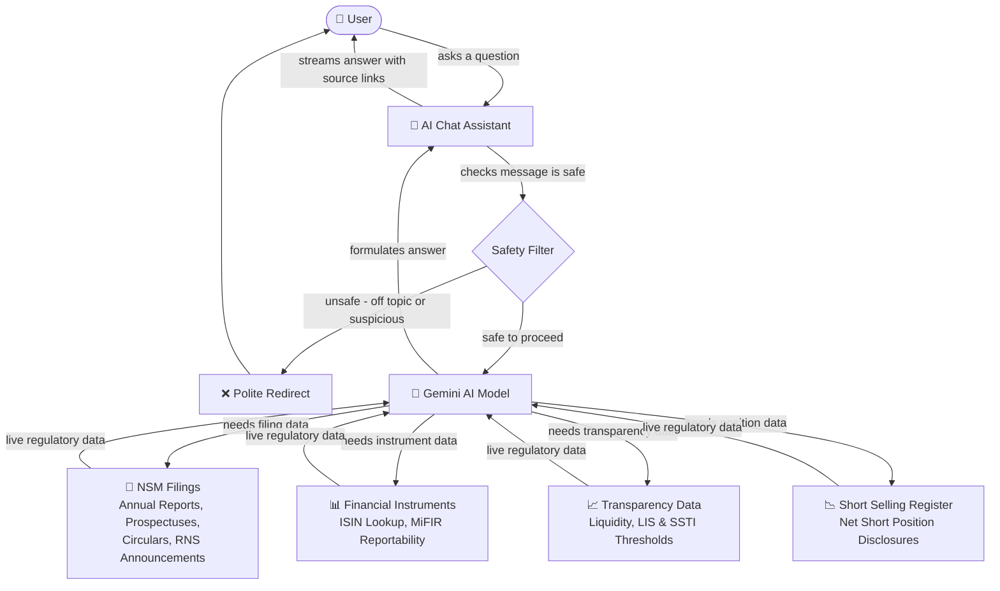

# FCA Chatbot — Data Flow Diagram

```mermaid
flowchart TD
    User([👤 User]) -->|asks a question| Chat[💬 AI Chat Assistant]

    Chat -->|checks message is safe| Filter{Safety Filter}
    Filter -->|unsafe - off topic or suspicious| Blocked[❌ Polite Redirect]
    Blocked --> User

    Filter -->|safe to proceed| AI[🤖 Gemini AI Model]

    AI -->|needs filing data| NSM[📄 NSM Filings\nAnnual Reports, Prospectuses,\nCirculars, RNS Announcements]
    AI -->|needs instrument data| FIRDS[📊 Financial Instruments\nISIN Lookup, MiFIR Reportability]
    AI -->|needs transparency data| FITRS[📈 Transparency Data\nLiquidity, LIS & SSTI Thresholds]
    AI -->|needs position data| SSR[📉 Short Selling Register\nNet Short Position Disclosures]

    NSM & FIRDS & FITRS & SSR -->|live regulatory data| AI

    AI -->|formulates answer| Chat
    Chat -->|streams answer with source links| User
```
